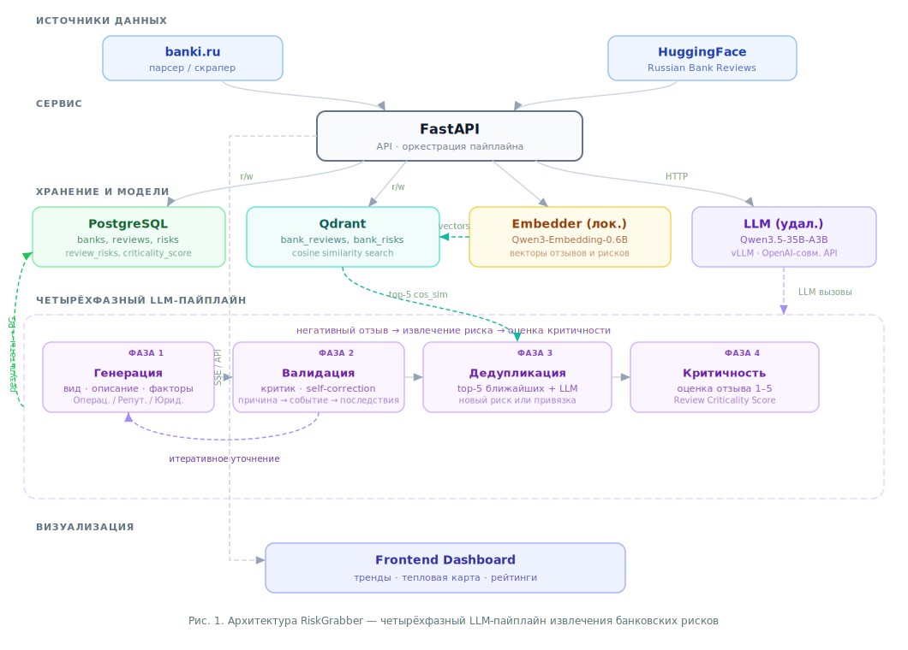

# RiskGrabber

**68-я Всероссийская научная конференция МФТИ**

Система обнаружения банковских рисков на основе отзывов клиентов с использованием методов NLP.

Выявление рисков на ранних стадиях является требованием регуляторов к кредитным организациям. Клиентские отзывы представляют собой массовый и оперативный источник информации о реализации возможных рисков. Ручной мониторинг такого объёма данных нецелесообразен; автоматическое извлечение формализованных рисков из неструктурированного текста при обеспечении единого реестра без дубликатов составляет отдельную задачу.

В данной системе сбор отзывов (парсер banki.ru или датасет HuggingFace), отбор негативных, извлечение рисков двух видов и ведение реестра с семантической дедупликацией реализованы на базе NLP и LLM. Система рассматривает два вида рисков:

- **Операционный риск** — клиент описывает конкретную проблему в работе банка: сбои IT-систем и приложений, ошибки сотрудников, проблемы поддержки, некорректные операции, нарушения процессов, проблемы с продуктами и сервисами.
- **Репутационный риск** — клиент не описывает конкретного сбоя, а транслирует негатив: слухи, сплетни, инфоповоды, эмоциональные обвинения, PR-атаки конкурентов, призывы уходить из банка — то, что не связано с явной работой банка.

Результаты отображаются на дашборде: тренды по банкам, тепловая карта «банк × вид риска», рейтинг по агрегированному показателю рисков для сравнения организаций и анализа динамики.

---

## Модели и данные

- **LLM по умолчанию:** [Qwen3.5-35B-A3B](https://huggingface.co/Qwen/Qwen3.5-35B-A3B) — генерация и валидация рисков, дедупликация по каталогу, оценка критичности отзыва (1–5).
- **Эмбеддер по умолчанию:** [Qwen3-Embedding-0.6B](https://huggingface.co/Qwen/Qwen3-Embedding-0.6B) — векторные представления отзывов и рисков для семантического поиска и визуализации.
- Можно использовать любые модели с HuggingFace, указав их в параметрах запуска приложения.
- **Датасет с отзывами:** [Romjiik/Russian_bank_reviews](https://huggingface.co/datasets/Romjiik/Russian_bank_reviews) (отзывы о банках, собранные с banki.ru).

---

## Схема и устройство системы

Ниже приведено описание компонентов и процессов, отражённых на схеме.

### Источники данных

- **banki.ru** — парсер (скрапинг страниц отзывов).
- **HuggingFace** — датасет [Russian Bank Reviews](https://huggingface.co/datasets/Romjiik/Russian_bank_reviews), загрузка в БД.

### Хранение

- **PostgreSQL** — банки, отзывы, риски, связки «отзыв–риск». В БД сохраняются итоговый риск по каждому отзыву и оценка критичности отзыва (1–5); на этих данных строятся аналитика, тренды, матрицы и рейтинги.
- **Qdrant** — векторная БД: коллекции эмбеддингов отзывов (`bank_reviews`) и рисков (`bank_risks`), поиск по косинусной близости.

### Приложение (FastAPI)

Сервер на **FastAPI** обслуживает API и дашборд, координирует пайплайн обработки отзывов, обращается к локальному модулю эмбеддингов и к LLM по заданному адресу (vLLM и др.), записывает результаты в PostgreSQL и Qdrant.

### NLP-обработка (локально)

- **Эмбеддинги** — считаются **локально** (модель Qwen3-Embedding-0.6B или аналог). По тексту отзыва строится вектор; векторы сохраняются в Qdrant и используются для семантического поиска и UMAP-визуализации.
- **Классификация тональности** — zero-shot по вектору отзыва (негативный / нейтральный / позитивный). В пайплайн рисков попадают только негативные отзывы.

### Четырёхфазный LLM-пайплайн

1. **Генерация** — по тексту негативного отзыва LLM предлагает один риск: вид (Операционный / Репутационный), описание события, факторы, последствия.
2. **Валидация (критик)** — второй вызов LLM проверяет соответствие стандарту «причина → событие → последствия»; при необходимости риск возвращается на генерацию с комментарием (итеративное уточнение).
3. **Дедупликация** — семантический поиск по каталогу рисков в Qdrant (top-K), затем LLM решает: привязать отзыв к существующему риску или создать новый в реестре.
4. **Оценка критичности** — LLM выставляет отзыву балл 1–5.

По завершении пайплайна **итоговый риск** (и при необходимости новый риск в реестре) записывается в **PostgreSQL** (таблицы `risks`, `review_risks`); **оценка критичности отзыва** (1–5) сохраняется в **PostgreSQL** (поле `reviews.criticality_score`). Эмбеддинг риска при создании нового записывается в Qdrant. Дашборд и отчёты строятся по данным из БД.

---

## Метрики

Используются три формулы: байесовская серьёзность по банку, сырая объединённая метрика и агрегированный показатель рисков. Обозначения: для банка $b$ за выбранный период $w_b$ — сумма баллов критичности (1–5) по отзывам с выявленными рисками, $n_b$ — число таких отзывов; $C = 3$ (prior mean), $m = 10$ (prior weight).

**1. Байесовская серьёзность** — сглаженное среднее критичности по отзывам банка с рисками. При малом $n_b$ оценка не уходит в крайности благодаря априорному среднему $C$ и весу $m$; результат лежит в [1, 5].

$$
s_b = \frac{w_b + m \cdot C}{n_b + m}, \quad s_b \in [1,\,5].
$$

**2. Сырая объединённая метрика** — сочетает «насколько серьёзны» риски ($s_b$) и «сколько» отзывов с рисками ($n_b$). Корень от $n_b$ ослабляет перекос в сторону банков с очень большим числом отзывов при сравнении.

$$
u_b = s_b \cdot \sqrt{n_b}.
$$

**3. Агрегированный показатель рисков банка** — итоговый показатель для рейтинга. Нормализация $u_b$ к шкале [1, 5] по максимуму среди всех банков: самый «рисковый» банк получает 5, остальные — пропорционально меньше.

$$
R_b = 1 + 4 \cdot \frac{u_b}{\max_k u_k}, \quad R_b \in [1,\,5].
$$

Дополнительно считаются: тренды по отрасли и по банку, тепловая карта «банк × вид риска» (средняя критичность по ячейкам), распределение отзывов по шкале критичности 1–5.